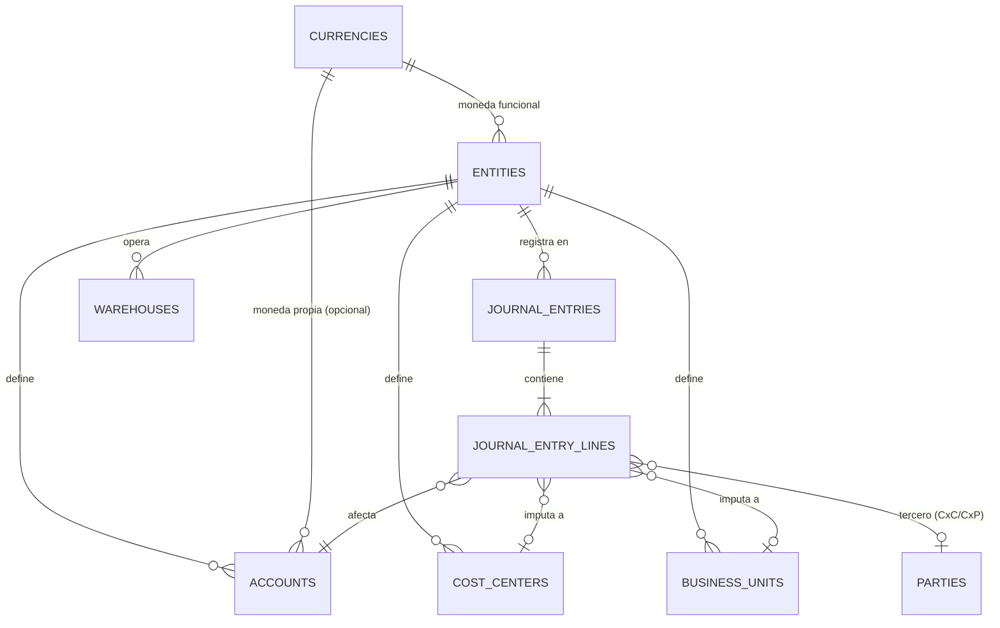

# RoadMap.md — EasyERP

> Preparado por Claude a partir de una auditoría del proyecto Lovable **EasyERP** (`lindsaybooks`) y de su origen, **Cacao Accounting** (`balazadeh-png/mybooks`), el 23 de agosto de 2026.
> Complementa a `ARQUITECTURA.md`, `MODULOS.md` y `CHANGELOG.md` en esta misma carpeta.

---

## 1. Resumen Ejecutivo

EasyERP nació como una migración a Lovable (TanStack Start + Supabase) de **Cacao Accounting**, un ERP contable en Flask/Python que ya tienes construido con ~150 modelos de datos y motores maduros (partida doble, multi-libro, multimoneda por cuenta, revalorización cambiaria, dimensiones analíticas). Lo que existe hoy en Lovable es únicamente la **Fase 1** de un plan de migración de 5 fases que ya estaba trazado en `.lovable/plan/migrate-cacao-accounting-into-lovable-2026-08-22.md`: el cascarón (auth, roles, catálogo de cuentas, libro mayor simple, terceros, inventario básico), sin la profundidad funcional del original.

Tu encargo — multiempresa, multimoneda con cuentas en moneda distinta a la funcional, centros de costo por unidad/sucursal, multibodega, y luego Activos Fijos, Producción, POS y cumplimiento SII — es exactamente el resto del plan de migración, más los módulos nuevos que ni siquiera Cacao Accounting tiene todavía. Buena noticia: no partimos de cero conceptualmente. Mala noticia (y hay que decirlo con franqueza): **ninguno de los cuatro requisitos que describes está realmente implementado hoy**, aunque el esquema ya tiene columnas que sugieren lo contrario. El detalle está en la sección 2.

Este documento propone:
- **Fase 1 (7 sprints):** cerrar las brechas de fundación — multiempresa real, motor de partida doble real, multimoneda real, centros de costo/unidades, multibodega real, ciclo transaccional de ventas/compras, y cierre de período con revalorización cambiaria.
- **Fase 2 (6 sprints):** los módulos que pediste para la segunda etapa — Activos Fijos, Producción, Ventas POS, Libros Contables SII, Declaración de Impuestos SII y Declaraciones Juradas SII.

Cada sprint tiene su propio archivo en `.md/prompts/` con el detalle técnico y un prompt listo para pegar en Lovable.

---

## 2. Diagnóstico — Estado Actual de EasyERP

### 2.1 Lo que ya funciona (la base es sana)

- El patrón `has_role()` con `SECURITY DEFINER` está bien implementado — evita el problema clásico de recursión infinita en RLS de Supabase.
- La migración del 22-ago ya reemplazó políticas 100% abiertas por una matriz de roles razonable (`admin`/`accountant`/`sales`/`purchasing`/`inventory`/`viewer`).
- La localización a Chile (RUT, CLP con 0 decimales, formateo `es-CL`, timezone `America/Santiago`) está aplicada de forma consistente.
- El stack (React 19 + TanStack Start + Supabase + shadcn) es sólido y coincide con el resto de tus proyectos.

### 2.2 Brechas críticas frente a lo que pediste

| Área | Estado real hoy | Brecha |
|---|---|---|
| **Multiempresa** | Existe la tabla `entities`, pero el formulario de alta hardcodea `currency: "CLP"` y **ninguna política RLS filtra por `entity_id`**. Cualquier usuario con rol `accountant` lee y escribe cuentas, asientos y terceros de **todas** las empresas a la vez. No existe tabla de asignación usuario↔empresa ni selector de "empresa activa" en la UI. | 0% funcional a nivel de aplicación, aunque el 30% del modelo de datos ya tiene la columna lista. |
| **Multimoneda** | `entities.currency` es texto libre (ni siquiera FK a `currencies`), por lo que una empresa solo admite **una** moneda. `accounts` no tiene moneda propia — no puedes marcar "esta cuenta banco opera en USD". El diálogo de asientos en `/accounting` inserta `currency: "CLP"` fijo en el código. No hay motor de revalorización cambiaria. | Existe el catálogo de monedas y tasas, pero no hay motor contable multimoneda real. |
| **Centros de Costo / Unidades** | No existen tablas `cost_centers` ni `units`/`sucursales`. Ningún asiento puede imputarse a una sucursal o centro de costo. | Inexistente. |
| **Multibodega** | `warehouses` existe como catálogo (con `entity_id`), pero no hay movimientos de inventario, saldo por bodega, traslados ni capas de valorización FIFO real, pese a que `items.valuation_method` dice `"FIFO"`. | Catálogo sin motor. |
| **Partida doble real** | El diálogo "Registrar Asiento" inserta **una fila suelta** (un débito o un crédito) por vez — sin cabecera de comprobante, sin exigir que el total debe = total haber, sin numeración real (existe `naming_series` pero no se usa), sin protección contra editar/borrar asientos ya posteados. | El "libro mayor de partida doble" no impone partida doble. Esto hay que resolverlo antes de construir más encima. |
| **Ventas / Compras** | Solo son directorios de clientes/proveedores (`parties` + `contacts`). No hay cotizaciones, órdenes ni facturas. | Sin este nivel no existe forma de generar automáticamente los asientos de CxC/CxP en moneda extranjera que mencionas como caso de uso (facturas de importación/exportación). |

### 2.3 Por qué me apoyo en Cacao Accounting para el diseño

Tu Flask original ya resuelve — con un diseño maduro y probado — exactamente los cuatro problemas que planteas:

- **`Entity`** = empresa con **una** moneda funcional (FK real a `Currency`).
- **`Unit`** = sucursal/oficina, jerárquica, dimensión analítica de primer nivel en el GL — esto es tu "control por unidades o sucursales".
- **`CostCenter`** = una dimensión *separada* de `Unit`, también jerárquica — porque en la práctica un centro de costo (ej. "Marketing") puede cruzar varias sucursales, y una sucursal puede tener varios centros de costo. Te recomiendo mantener ambas dimensiones distintas en vez de fusionarlas: es más flexible y es el patrón que SAP y tu propio Cacao Accounting ya usan.
- **`Account.currency`** = moneda propia por cuenta, nullable (si es null, hereda la moneda de la empresa). Así una empresa en CLP puede tener "Banco Santander USD" con su propio saldo en dólares.
- **`GLEntry`** separa `debit`/`credit` (en moneda funcional) de `debit_in_account_currency`/`credit_in_account_currency` (en la moneda de la cuenta), con `exchange_rate` y las columnas `cost_center_code`/`unit_code`/`project_code` — este es el patrón exacto que necesitamos portar a Postgres.
- **`ExchangeRevaluation`** = motor de revalorización cambiaria de cierre (ganancia/pérdida no realizada).
- **`Warehouse` + `WarehouseCompanyAccount`** = multibodega con cuenta de inventario configurable por empresa.
- **`CompanyDefaultAccount`** = las ~25 cuentas por defecto que necesita cualquier ERP para postear automáticamente (CxC, CxP, IVA débito/crédito, diferencia de cambio realizada/no realizada, etc.).

Ninguno de los módulos de Fase 2 que pediste (Activos Fijos, Producción, POS, SII) existe todavía en Cacao Accounting — ahí sí construimos desde cero.

---

## 3. Arquitectura Objetivo

### 3.1 Multiempresa y seguridad

- Nueva tabla `company_users` (usuario ↔ empresa ↔ rol dentro de esa empresa).
- Función `public.user_has_company_access(_user_id, _entity_id)` (mismo patrón `SECURITY DEFINER` que `has_role()`).
- Toda tabla operativa gana una política RLS que combina rol **y** pertenencia a la empresa — nunca solo una de las dos.
- Selector de "empresa activa" en `AppHeader`, persistido en el perfil del usuario.

### 3.2 Multimoneda

- `entities.currency` migra a FK real (`base_currency_code`).
- `accounts` gana `currency_code` (nullable = hereda de la empresa).
- El libro mayor pasa a registrar el monto en ambas monedas (funcional y de cuenta) más el tipo de cambio usado.
- Proceso de cierre mensual que revaloriza saldos abiertos en moneda extranjera (bancos, CxC, CxP) contra la tasa de cierre.

### 3.3 Centros de Costo y Unidades/Sucursales

- `cost_centers` y `business_units`, ambas jerárquicas, ambas por empresa.
- Cada línea de asiento puede llevar ambas dimensiones (opcional, pero recomendado obligatorio para cuentas de resultado).
- Reportes (Balance General, P&L) filtrables y agrupables por unidad y centro de costo.

### 3.4 Multibodega

- `stock_ledger_entries` (movimiento inmutable) + `stock_valuation_layers` (capas FIFO) + saldo derivado por bodega.
- Traslados entre bodegas como par receipt/issue con el mismo voucher.

### 3.5 Dimensiones del asiento contable (diagrama objetivo)

Cada línea de asiento queda anclada a: una cuenta (con su propia moneda), un centro de costo, una unidad/sucursal y, si corresponde, un tercero — todo dentro de una empresa.

### 3.6 Decisión pendiente clave: Facturación Electrónica (DTE)

Esto no lo mencionaste, pero es una dependencia dura para que Ventas, POS y los Libros SII tengan validez tributaria real en Chile: toda factura/boleta debe emitirse como **DTE** (Documento Tributario Electrónico) con folios autorizados por el SII (CAF) y firma electrónica. Hay dos caminos, y conviene decidirlo antes del Sprint 6:

1. **Integrar un emisor de DTE certificado ya existente** (ej. OpenFactura/Haulmer, Bsale, Nubox, Defontana, o el portal gratuito del propio SII) vía API. Más rápido, sin proceso de certificación propio.
2. **Convertirse en emisor DTE propio** ante el SII. Mucho más esfuerzo (certificación, manejo de CAF, firma, webservices SOAP del SII), pero sin dependencia de terceros.

No lo resuelvo en este roadmap porque es una decisión de negocio, no solo técnica — pero lo dejo como bloqueante explícito para el Sprint 6 (facturación) y el Sprint 11 (Libro de Compras y Ventas).

---

## 4. Hoja de Ruta — Fase 1: Fundación ERP Multiempresa

| # | Sprint | Objetivo | Prompt |
|---|---|---|---|
| 1 | Multiempresa Real y Seguridad | Aislar datos por empresa a nivel de RLS + selector de empresa activa | `sprint-01-multiempresa-seguridad.md` |
| 2 | Motor Contable de Partida Doble | Reemplazar el insert de filas sueltas por comprobantes balanceados, reversibles e inmutables | `sprint-02-motor-partida-doble.md` |
| 3 | Multimoneda a Nivel de Cuenta | Cuentas con moneda propia + asientos duales (moneda cuenta / moneda funcional) | `sprint-03-multimoneda-cuentas.md` |
| 4 | Centros de Costo y Unidades/Sucursales | Dimensiones jerárquicas + su uso en asientos y reportes | `sprint-04-centros-costo-unidades.md` |
| 5 | Multibodega Real | Movimientos de inventario, traslados, valorización FIFO por bodega | `sprint-05-multibodega.md` |
| 6 | Ciclo Transaccional Ventas y Compras | Facturas con posteo automático a GL, CxC/CxP reales (⚠️ depende de la decisión DTE) | `sprint-06-ventas-compras-transaccional.md` |
| 7 | Cierre de Período y Revalorización Cambiaria | Ganancia/pérdida cambiaria no realizada + checklist de cierre mensual | `sprint-07-cierre-revalorizacion.md` |

Los sprints 1 y 2 no son negociables en orden: si se construye multimoneda o centros de costo sobre el modelo actual, hay que rehacerlos apenas se corrija la base. Los sprints 3, 4 y 5 pueden reordenarse entre sí según lo que más te urja operar primero.

## 5. Hoja de Ruta — Fase 2: Módulos Ampliados

| # | Sprint | Objetivo | Prompt |
|---|---|---|---|
| 8 | Activos Fijos | Alta, depreciación mensual automática, bajas y revalorización | `sprint-08-activos-fijos.md` |
| 9 | Producción | Lista de materiales (BOM), órdenes de producción, costeo de producto terminado | `sprint-09-produccion.md` |
| 10 | Ventas POS | Turnos de caja, venta rápida, arqueo, descuento de inventario en tiempo real | `sprint-10-ventas-pos.md` |
| 11 | Libros Contables SII | Libro Diario/Mayor en formato electrónico exigido + conciliación con el Registro de Compras y Ventas (RCV) | `sprint-11-libros-sii.md` |
| 12 | Declaración de Impuestos SII | Motor de cálculo de IVA/PPM para F29 mensual y apoyo al F22 anual | `sprint-12-declaracion-impuestos-sii.md` |
| 13 | Declaraciones Juradas SII | Motor extensible de DJs (empezando por las más comunes: 1879, 1887, entre otras) | `sprint-13-declaraciones-juradas-sii.md` |

Los sprints 11-13 son terreno regulatorio que cambia todos los años — los prompts incluyen la arquitectura de datos, pero **los campos exactos de cada formulario/DJ deben validarse contigo (o tu equipo contable) contra la normativa SII vigente al momento de construir**, no contra este documento.

---

## 6. Riesgos y Dependencias

- **Migración de datos ya cargados**: si ya ingresaste cuentas/asientos de prueba con `entity_id` nulo, el Sprint 1 necesita una migración de backfill antes de activar RLS estricto, o quedarán datos huérfanos e inaccesibles.
- **DTE (facturación electrónica)**: bloqueante real para Sprints 6, 10, 11 y 12 con validez tributaria. Decidir "comprar vs. construir" antes de llegar al Sprint 6.
- **Rendimiento de RLS**: con múltiples empresas y `journal_entry_lines` creciendo, las políticas RLS con subconsultas a `company_users` deben indexarse bien (`entity_id`, `user_id`) o se sentirá en reportes grandes.
- **Consolidación multiempresa** (un balance combinado de varias empresas con distinta moneda funcional) es genuinamente compleja (cuenta de conversión de moneda extranjera) — la dejo fuera del alcance de Fase 1 y la marco como candidata para una fase 3, evaluar si de verdad la necesitas.
- **Plan de cuentas estándar**: conviene definir un plan de cuentas chileno de referencia (o importar el de Cacao Accounting) antes del Sprint 6, para que `company_default_accounts` tenga a qué apuntar.

## 7. Cómo trabajar con estos documentos

1. Un sprint a la vez. Pega el prompt correspondiente en Lovable, revisa el preview, valida los criterios de aceptación del archivo antes de pasar al siguiente.
2. Al cerrar cada sprint, agrega una entrada en `CHANGELOG.md` (mismo formato que ya usas) y actualiza `MODULOS.md`/`ARQUITECTURA.md` si el sprint agregó un módulo o cambió el modelo de datos.
3. Si reordenas sprints dentro de la Fase 1 (excepto el 1 y 2, que van primero sí o sí), actualiza la tabla de la sección 4 para que quede como fuente de verdad de en qué vamos.

---

## 8. Vertical 3PL (Sprints 16 a 28) — ✅ 100% Implementada y Validada

La vertical de bodegaje, transporte y logística para terceros (3PL) fue diseñada y construida íntegramente sobre el núcleo contable y transaccional de EasyERP, cubriendo 13 sprints organizados en 4 fases estructurales (ver detalle exhaustivo en `RoadMap-Vertical-3PL.md`):

1. **Fase 1 — Cumplimiento (Sprints 16, 17, 18):**
   - Sprint 16: Modelo de datos 3PL (`parties.is_3pl_client`, `party_warehouses`, `party_id` en kardex) y Guía de Despacho (Res. Ex. SII 154/2024).
   - Sprint 17: Comercio exterior con conexión SICEX, DUS, carpetas de embarque y certificados sanitarios.
   - Sprint 18: Libros Legales heredados, validación de no-contaminación contable en cuentas de orden y certificación en `PRODUCCION-3PL.md`.

2. **Fase 2 — Operación (Sprints 19, 20, 21, 22, 23):**
   - Sprint 19: WMS — Recepción, control de calidad (aprobación/rechazo/cuarentena) y ubicación/slotting en bodega.
   - Sprint 20: WMS — Picking, packing, validación de bultos y trazabilidad por lote y serie.
   - Sprint 21: TMS — Planificación de despachos, optimización de rutas y gestión de flota propia y externa.
   - Sprint 22: TMS — Tracking GPS en tiempo real, mapa interactivo y conector a couriers (Blue Express, Chilexpress, Starken).
   - Sprint 23: OMS — Pedidos multicanal (e-commerce, B2B, manual), webhook receiver y enrutamiento inteligente a bodegas.

3. **Fase 3 — Comercial (Sprints 24, 25, 26):**
   - Sprint 24: Portal de Clientes 3PL con acceso aislado y seguro vía RLS por `party_id` para consulta de inventario, pedidos y documentos.
   - Sprint 25: Contratos y matrices de tarifas (almacenaje por m³/pallet, picking, despacho por km/tramo y cobro mínimo mensual).
   - Sprint 26: Facturación mensual de servicios logísticos integrada directamente a `sales_invoices` y comprobantes contables GL, con liquidación en lote y notas de crédito/débito de ajuste.

4. **Fase 4 — Inteligencia y BI (Sprints 27, 28):**
   - Sprint 27: Dashboard BI y KPIs Operacionales (OTIF por cliente, monitoreo y alertas de SLA en riesgo, costo por unidad procesada mediante `operational_cost_inputs` y ocupación volumétrica m³ de naves).
   - Sprint 28: BI y KPIs Comerciales (Rentabilidad por cliente 3PL: facturación neta real vs. asignación proporcional de costos de gestión, margen estimado y filtros de ordenamiento).

